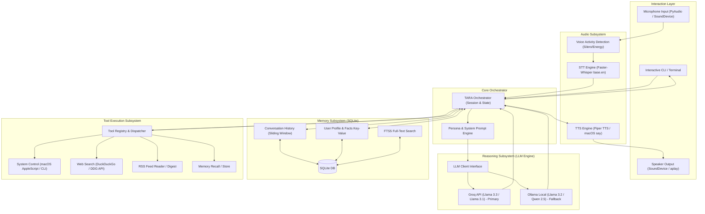

# Architecture Document — TARA

**System:** Transformative AI Reasoning Architecture (TARA)  
**Target Hardware:** Apple MacBook Air M1 (8GB Unified Memory)  
**Design Paradigm:** Local-First, Hybrid Inference, Event-Driven Sequential Pipeline  

---

## 1. High-Level System Architecture

TARA follows a clean, modular pipeline architecture where each component is isolated by a strict interface, allowing components to be swapped or upgraded without touching the core orchestration logic.



---

## 2. Component Breakdown & Resource Budget

| Subsystem | Primary Tech | Secondary / Fallback | RAM Footprint | Typical Latency |
| :--- | :--- | :--- | :--- | :--- |
| **STT (Ear)** | `faster-whisper` (`base.en`, int8) | `tiny.en` | ~150 MB | ~150–300 ms |
| **TTS (Voice)** | `piper-tts` (ONNX voice `en_US-lessac-medium`) | macOS `say` utility | ~30 MB (Piper) / 0 MB (`say`) | ~100–200 ms |
| **LLM (Brain)** | Groq API (`llama-3.3-70b-versatile`) | Ollama (`llama3.2:3b` q4) | ~10 MB (Cloud) / ~2.0 GB (Ollama) | 200–500 ms (Groq) / 1.5–3s (Ollama) |
| **Memory (Recall)**| SQLite3 (Built-in Python `sqlite3`) | In-memory cache | < 10 MB | < 5 ms |
| **Tools (Hands)** | Native Python subprocess / DuckDuckGo | `urllib` / `httpx` | < 25 MB | 200–800 ms (network dependent) |
| **Total Target** | — | — | **~250 MB (Cloud) / ~2.4 GB (Local)** | **< 1.2s Voice-to-Voice** |

---

## 3. Data Flow & Execution Pipelines

### 3.1 Conversational Turn Pipeline (Voice / Text)
1. **Input Capture:** 
   - *Voice Mode:* Mic stream $\rightarrow$ VAD detects speech boundaries $\rightarrow$ audio chunk captured.
   - *Text Mode:* Standard CLI user prompt.
2. **Transcription (STT):** Audio chunk $\rightarrow$ Faster-Whisper $\rightarrow$ clean text string.
3. **Context Assembly:** 
   - Load persona system prompt.
   - Inject relevant user facts from Memory (SQLite).
   - Append recent conversation history (last $N$ messages).
   - Append current user query.
4. **Reasoning & Tool Selection (LLM):** 
   - Send assembled prompt + JSON tool definitions to LLM Provider (Groq / Ollama).
   - LLM decides: direct response OR tool call request.
5. **Tool Execution Loop (if tool requested):**
   - Orchestrator parses tool name and arguments.
   - Tool Dispatcher invokes the Python function.
   - Tool result is returned and appended to context as a `tool` role message.
   - LLM is called again with tool results to synthesize the final natural answer.
6. **Output & Speech (TTS):**
   - Text is printed to CLI.
   - Synthesizer (Piper / `say`) streams audio to speaker.
   - User input and assistant response are persisted to SQLite.

---

## 4. Directory & Folder Structure

Following our anti-overengineering philosophy, the project is structured simply and intuitively:

```
TARA/
├── docs/                      # Architectural & design documentation
│   ├── PRD.md
│   ├── Architecture.md
│   ├── Rules.md
│   ├── Phases.md
│   ├── Design.md
│   └── Memory.md
├── data/                      # Local storage (models, voices, DB)
│   ├── tara.db                # SQLite database (auto-created)
│   └── voices/                # Piper TTS ONNX models (if downloaded)
├── tara/                      # Main source package
│   ├── __init__.py            # Package metadata & version
│   ├── config.py              # Central configuration (env vars, settings)
│   ├── orchestrator.py        # Central state machine & flow controller
│   ├── audio/                 # Audio I/O (STT & TTS)
│   │   ├── __init__.py
│   │   ├── stt.py             # Faster-Whisper wrapper + VAD
│   │   └── tts.py             # Piper TTS + macOS 'say' fallback
│   ├── brain/                 # LLM engines & persona
│   │   ├── __init__.py
│   │   ├── llm_client.py      # Unified client for Groq & Ollama
│   │   └── persona.py         # System prompts & character instructions
│   ├── memory/                # SQLite storage & fact retrieval
│   │   ├── __init__.py
│   │   └── store.py           # SQLite manager (history + key-value facts)
│   └── tools/                 # Tool implementations & registry
│       ├── __init__.py
│       ├── registry.py        # Decorator-based tool dispatcher
│       ├── system_tools.py    # macOS controls, battery, time
│       ├── web_tools.py       # DuckDuckGo search, RSS reader
│       └── memory_tools.py    # Save/search user facts via tool calling
├── tests/                     # Unit & integration tests
│   ├── test_memory.py
│   ├── test_tools.py
│   └── test_llm.py
├── .env.example               # Template for environment variables (GROQ_API_KEY)
├── requirements.txt           # Lean Python dependencies
├── main.py                    # Entry point (CLI & Voice interaction modes)
└── README.md                  # Project overview & quickstart guide
```

---

## 5. Modularity & Swappability Interfaces

To maintain longevity without code bloat, interfaces are kept minimal:

- **LLM Interface:** A single method `generate(messages: list[dict], tools: list[dict] = None) -> LLMResponse`
- **STT Interface:** `transcribe(audio_data: bytes | np.ndarray) -> str`
- **TTS Interface:** `speak(text: str, blocking: bool = True) -> None`
- **Tool Interface:** Standard Python functions with type annotations and docstrings registered via `@tool` decorator.
